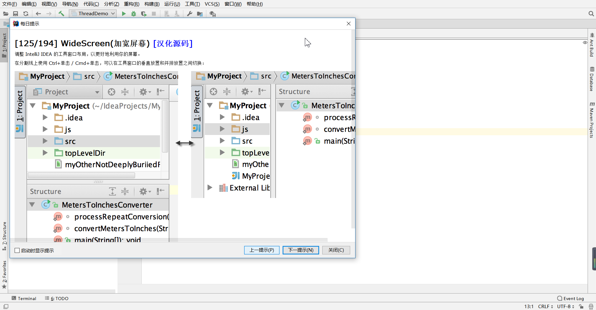

## IntelliJ IDEA localization Chinese language pack（简繁中文）

把压缩包里的"resources_zh_CN.jar"拷贝到IDEA安装目录下的lib目录，重启即可！

---------------------------------------------------------------------
欢迎更多汉化者修改！！！共同努力，尽力做到完美！（注意：修改需在“更新.txt”里写明修改的大致内容）

另外由 @pingfangx 汉化的 Android Studio 在[这里](https://github.com/pingfangx/TranslatorX/releases)
